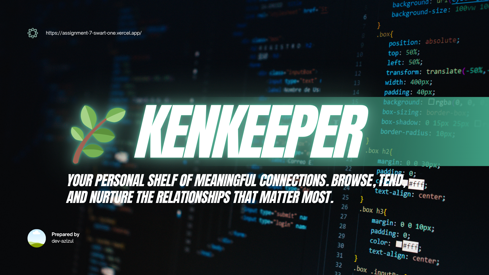
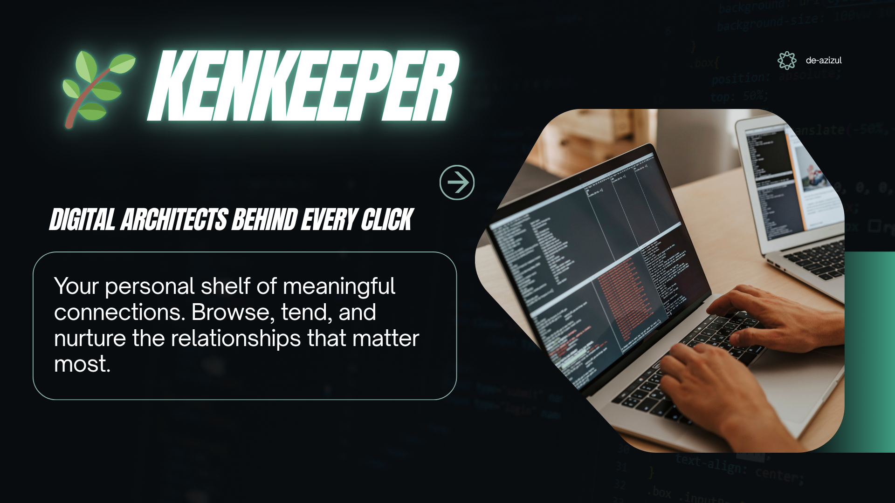

# 🌿 KeenKeeper



> **Your personal shelf of meaningful connections.**
> Browse, tend, and nurture the relationships that matter most.

🔗 **Live Demo:** [https://assignment-7-swart-one.vercel.app/](https://assignment-7-swart-one.vercel.app/)

---

## 📖 Short Description

KeenKeeper is a personal relationship management app that helps you stay connected with the people who matter most. Track your friendships, log interactions, and visualize your communication habits — all in one place.

---

## 🛠️ Technologies Used

| Technology | Purpose |
|------------|---------|
| **Next.js 15** | Full-stack React framework |
| **Tailwind CSS** | Utility-first styling |
| **DaisyUI** | UI component library |
| **Recharts** | Data visualization & pie charts |
| **React Icons** | Icon library |
| **React Spinners** | Loading animations |
| **React Toastify** | Toast notifications |
| **Vercel** | Deployment & hosting |

---

## ✨ Key Features



### 🤝 1. Friend Tracking
Keep track of all your important relationships in one place. Each friend has a detailed profile with status indicators — **On Track**, **Almost Due**, or **Overdue** — so you always know who needs attention.

### ⏱️ 2. Timeline Log
Log every **Call**, **Text**, and **Video** interaction with your friends. Filter interactions by type and see your full interaction history in a clean, organized timeline.

### 📊 3. Friendship Analytics
Visualize your communication patterns with beautiful **pie charts**. See at a glance how you're staying in touch — whether through calls, texts, or video chats.

---

## 📁 Project Structure

```
src/
├── app/
│   ├── (main)/
│   │   ├── friends/[id]/   # Friend detail page
│   │   ├── timeLine/       # Timeline page
│   │   └── stats/          # Analytics page
├── components/
│   ├── Navbar/
│   ├── Footer/
│   ├── Banner/
│   ├── Friends/
│   ├── FriendsList/
│   └── callInfo/
├── context/
│   └── TimelineContext.jsx  # Global state management
public/
└── data.json               # Friends data
```

---

## 🚀 Getting Started

```bash
# Clone the repository
git clone https://github.com/azizul-dev/assigment-7

# Install dependencies
npm install

# Run the development server
npm run dev
```

Open [http://localhost:3000](http://localhost:3000) in your browser.

---

<p align="center">Made with ❤️ by <strong>Md. Azizul Islam</strong></p>